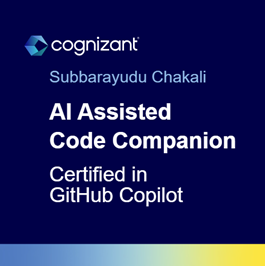

### I'm Currently

```yaml
- Working as Software Engineer in Chennai, India 
- Studying M TECH in Artificial Intelligence & Machine Learning (AI & ML) from BITS Pilani Work Integrated Learning Program (WILP).
- Learning Generative AI, Prompt Engineering and Machine Learning 
```

### [View My Resume](./resources/subbarayudu-chakali-resume.pdf)
<!-- <iframe src="./resources/subbarayudu-chakali-resume.pdf" width="500" height="400"></iframe> -->
 
### My Experience Journey

| Employer | Role | Duration | Skills | Location |
|---------|------|----------|--------|-------------|
| Cognizant | Product Specialist - Technical | January 2023 - Present | Generative AI (Currently Learning), AWS AI ML and Security Services, Python, Power Platform, Postgres | Chennai, Tamil Nadu, India |
| Cognizant | Programmer Analyst | January 2022  December 2023 (1 year) | Microsoft Azure, DevOps, Git, Microservices, AWS, Kotlin, REST, MongoDB, Insurance Domain, | Chennai, Tamil Nadu, India |
| Cognizant | Programmer Analyst Trainee | January 2021 - December 2021 (1 year) | Java, Maven, Spring Framework, MySQL, Web Design and Development, Agile Development, SDLC | Chennai, Tamil Nadu, India |

<!--
### Projects 
- Intelligent Documents Processing
- Datasets Generation (Text, CSV, JSON, Pdf)
- Customized Foundation Models for Insurance industry
- Software Bill Of Materials (SBOM) 
- Automatic reports validation and analysis using AI 
-->

### Languages


### Databases


### DevSecOps


### Platforms and Frameworks


### User Interface


### IDE/Editors


<!--
```yaml
- Programming Languages:
- Front-End:
- Back-End:
- Databases:
- DevSecOps:
- Cloud Computing:
- Machine Learning:
- Data Analysis:
```
-->
### Other Tools


<!-- ### Platforms I use for my learning


 -->

<!--
Learning Resources and other skills
Separate the tools into: Front-End, DevOps, Backend, Databases, Cloud, Design Patterns/Architecture, Learning  tools, IDEs/Editors, include monitoring and security services in devsecops, AWS Services like sagemaker, IAM, CloudFormation, Lambda, RDS, DynamoDB, EC2, ECS, etc,.
-->

<!--


-->

### Certificates

* [AWS Certified Cloud Practitioner](https://www.credly.com/badges/62900457-e8b0-4032-a2ea-c938088fd784/public_url)
* [AWS Certified AI Practitioner Early Adopter](https://www.credly.com/badges/e43c6fa6-7731-4346-9376-2df8672a060a/public_url)
* [AZ-900 Microsoft Azure Fundamentals](https://www.credly.com/badges/d57d7a2d-3d84-4c02-bf04-6d015b4d5fe9/public_url)
* [PL-900 Microsoft Power Platform Fundamentals](https://learn.microsoft.com/api/credentials/share/en-us/ChakaliSubbarayuduCognizant-3715/3EE8BEF23F9F5310?sharingId=2E9CCBF6F3890D49)
* [GitHub Foundations](https://www.credly.com/badges/41daf202-1db7-4654-bf87-182c052b76bf/public_url)
* [GitHub Actions](https://www.credly.com/badges/f59dc4b7-5c7b-4f7d-8b7d-b216d1a96e9f/public_url)
* [GitHub CoPilot](https://www.credly.com/badges/8b14c6b7-fc99-47b4-b5ef-c49da4e6a735/public_url)

### Badges





<!--
Contact Details
-->
### WakaTime Metrics
<!--
Waatime metrics
-->
<!--START_SECTION:waka-->


**🐱 My GitHub Data** 

> 📦 429.6 kB Used in GitHub's Storage 
 > 
> 🚫 Not Opted to Hire
 > 
> 📜 4 Public Repositories 
 > 
> 🔑 11 Private Repositories 
 > 
**I'm a Night 🦉** 

```text
🌞 Morning                61 commits          ███░░░░░░░░░░░░░░░░░░░░░░   13.68 % 
🌆 Daytime                125 commits         ███████░░░░░░░░░░░░░░░░░░   28.03 % 
🌃 Evening                107 commits         ██████░░░░░░░░░░░░░░░░░░░   23.99 % 
🌙 Night                  153 commits         █████████░░░░░░░░░░░░░░░░   34.30 % 
```
📅 **I'm Most Productive on Thursday** 

```text
Monday                   77 commits          ████░░░░░░░░░░░░░░░░░░░░░   17.26 % 
Tuesday                  50 commits          ███░░░░░░░░░░░░░░░░░░░░░░   11.21 % 
Wednesday                70 commits          ████░░░░░░░░░░░░░░░░░░░░░   15.70 % 
Thursday                 106 commits         ██████░░░░░░░░░░░░░░░░░░░   23.77 % 
Friday                   25 commits          █░░░░░░░░░░░░░░░░░░░░░░░░   05.61 % 
Saturday                 45 commits          ███░░░░░░░░░░░░░░░░░░░░░░   10.09 % 
Sunday                   73 commits          ████░░░░░░░░░░░░░░░░░░░░░   16.37 % 
```


📊 **This Week I Spent My Time On** 

```text
🕑︎ Time Zone: Asia/Kolkata

💬 Programming Languages: 
No Activity Tracked This Week

🔥 Editors: 
No Activity Tracked This Week

💻 Operating System: 
No Activity Tracked This Week
```

**I Mostly Code in Python** 

```text
Python                   6 repos             ████████████░░░░░░░░░░░░░   50.00 % 
JavaScript               2 repos             ████░░░░░░░░░░░░░░░░░░░░░   16.67 % 
TypeScript               1 repo              ██░░░░░░░░░░░░░░░░░░░░░░░   08.33 % 
Java                     1 repo              ██░░░░░░░░░░░░░░░░░░░░░░░   08.33 % 
Jupyter Notebook         1 repo              ██░░░░░░░░░░░░░░░░░░░░░░░   08.33 % 
```


 Last Updated on 13/09/2025 18:42:48 UTC
<!--END_SECTION:waka-->

### Contact me

[](mailto:csubbu141@gmail.com)
[](https://in.linkedin.com/in/subbarayudu-chakali)
[](https://gitHub.com/subbarayudu-chakali)
[](https://Twitter.com/subbarayudu_c_)
[](https://instagram.com/subbarayudu_chakali)
[](https://www.facebook.com/profile.php?id=100024064763545&mibextid=ZbWKwL)
<!--


-->
